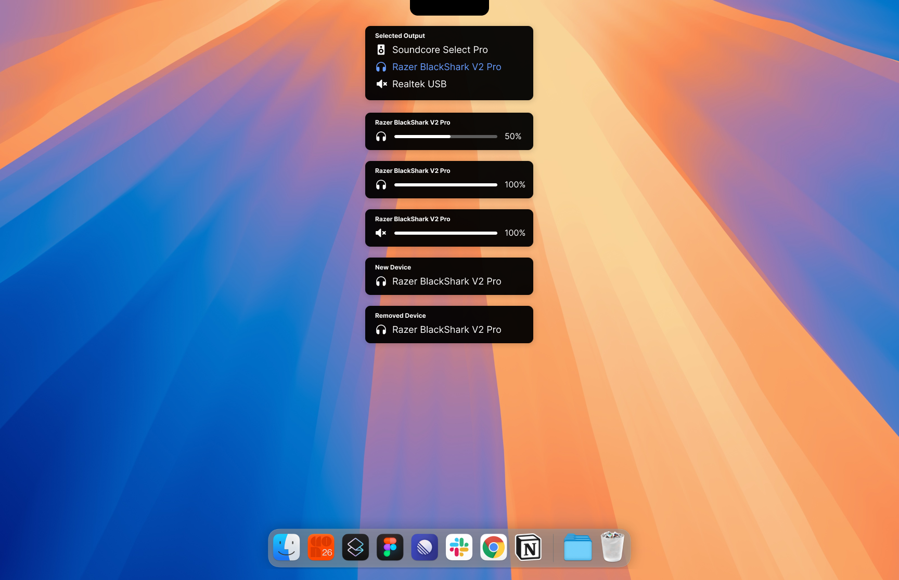

# 🎛️ Vontrol

Vontrol is an Electron-based app for seamless control of multiple audio output devices via keyboard shortcuts. Unlike the default Windows method that requires switching default output, Vontrol lets you switch between outputs and manage directly, making it perfect for enthusiasts with multiple devices.



---

## ✨ Features

- **🔀 Multiple Output Control**: Effortlessly switch between devices using shortcuts.
- **🔼🔽 Volume Adjustment**: Increase ⬆️, decrease ⬇️, or mute 🔇 the volume of selected device.
- **🖼️ Modern User-Friendly Interface**: Intuitive UI for managing and shortcuts.
- **❌ Non-Default Output Control**: Manage levels without altering the system's default.
- **📢 Device Detection Notifications**: Get notified when a new device is connected or removed.
- **⚙️ Customizable Config**: Allows users to customize ⌨️ shortcuts and blacklist specific 🎧 outputs.
- **📌 Tray Icon**: Quick access to essential functions, including:
  - 📝 Open Config File
  - ❌ Exit the Application

---

## ⚙️ Configuration

Vontrol provides a customizable `config.json` file, allowing users to modify default shortcuts and blacklist unwanted audio devices.

### Default Configuration
```config.json
{ 
    "shortcuts": {
      "nextDevice": "CmdOrCtrl+Alt+]",
      "previousDevice": "CmdOrCtrl+Alt+[",
      "increase": "Alt+]",
      "decrease": "Alt+[",
      "mute": "Alt+i"
    },
    "blacklist": []
}
```
### Features
- **🎚️ Custom Shortcuts**: Modify key bindings to fit personal preferences.
- **🚫 Blacklist Audio Devices**: Hide specific 🔊 outputs from selection.

For supported shortcut key bindings, refer to [Electron Shortcuts](https://www.electronjs.org/docs/latest/api/accelerator).

---

## 🛠️ Installation

### 📦 Prebuilt Version

Download the prebuilt app from the [🚀 Releases](https://github.com/D4rkTT/Vontrol/releases) section.

### 🏗️ Build from Source

1. Clone the repo:
   ```bash
   git clone https://github.com/D4rkTT/Vontrol.git
   cd vontrol
   ```
2. Install dependencies 📥:
   ```bash
   npm install
   ```
3. Build the app 🛠️:
   ```bash
   npm run dist
   ```

---

## 🖱️ Usage

1. Launch the app.
2. Use shortcuts to control audio outputs

---

## ⌨️ Shortcuts

- **➡️ Next Output**: `CmdOrCtrl+Alt+]`
- **⬅️ Previous Output**: `CmdOrCtrl+Alt+[`
- **🔼 Increase Volume**: `Alt+]`
- **🔽 Decrease Volume**: `Alt+[`
- **🔇 Mute/Unmute**: `Alt+i`

Now you can use signle keyboard knob and switch devices with same knob while holding Ctrl

---

## 🔮 TODO

- ~~✏️ Customizable shortcuts for enhanced flexibility.~~ ☑️
- ~~📌 Tray icon to control the app~~ ☑️

---

## 📝 Changelog

### 🆕 V1.0.0 Update
- 🐛 **Bug Fixes**: Improved stability and resolved reported issues.
- ⚡ **Code Optimization**: Enhanced performance and efficiency.
- 🎛️ **New Output Selection UI**: Redesigned interface for better device management.
- ⚙️ **Customizable Config**: Users can now modify shortcuts and blacklist specific devices.
- 📌 **Tray Icon**: Quick access menu for opening the config file and exiting the app.

---

## 🤝 Contributing

Contributions ❤️ are welcome! Follow these steps to contribute:

1. Fork the repo.
2. Create a branch 🛠️:
   ```bash
   git checkout -b feature/your-feature-name
   ```
3. Commit your changes 📝:
   ```bash
   git commit -m "Add your feature description"
   ```
4. Push changes 📤:
   ```bash
   git push origin feature/your-feature-name
   ```
5. Open a pull request 🔄.

---

## 📜 License

This project is licensed under the [MIT License](LICENSE).

---

## 🙌 Acknowledgments

- [native-sound-mixer](https://www.npmjs.com/package/native-sound-mixer): Core library for device management.

---

## 📧 Contact

Questions or Suggestions? Open an issue in the repo.

